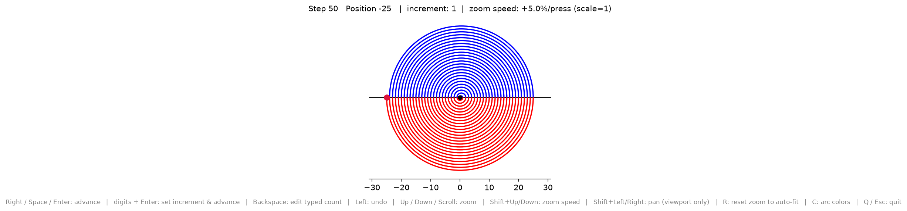
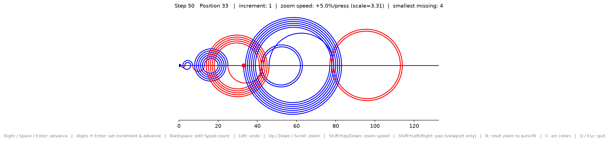

# arcs

Try it in the browser: [spiral](https://boazmichaely.github.io/arcs/) /
[recaman](https://boazmichaely.github.io/arcs/recaman.html) (runs entirely
client-side via [Pyodide](https://pyodide.org); first load takes ~10-20s).

Renders perfect half-circle arcs above and below a number line, tracing a
step sequence one step at a time. Steps alternate above/below by parity
(odd above, even below) in both variants, picked with `--variant`:

| `--variant` | Movement | Color |
| --- | --- | --- |
| `spiral` (default) | Odd `n` right, even `n` left | Follows arc side (above/below) |
| `recaman` | Recamán's sequence: try `pos - n` (if non-negative and unvisited), else `pos + n` | Follows rotational direction: **clockwise** if arc side agrees with movement direction (above-and-right, or below-and-left), **counter-clockwise** otherwise |

For `spiral`, side and movement direction always agree (odd `n` always
moves right), so side-based and rotation-based coloring would look
identical - that's why it uses the simpler one. `recaman`'s movement
doesn't follow parity, so rotational coloring is the more interesting
choice there.

`spiral` at step 50:


`recaman` at step 50:


`spiral` starts at `[-5, 5]` and grows/zooms out by 5 on each side whenever
a step lands outside the current view. `recaman` uses a fixed-width,
pannable viewport instead - see [Variants](#variants) for details.

Arcs are true circles (1:1 aspect ratio), and the window is freely resizable.
Arc-size labels show the signed step (`n` above, `-n` below) and are hidden
once the current step exceeds `max_step_to_render_arc_size` (default **10**);
undo back under that limit and they reappear.

## Credit

This project's rendering style (alternating semicircular arcs above/below a
number line) is inspired by the classic visualization of
[Recamán's sequence](https://en.wikipedia.org/wiki/Recam%C3%A1n%27s_sequence)
(OEIS [A005132](https://oeis.org/A005132)), invented by Colombian mathematician
Bernardo Recamán Santos. The arc-drawing method is credited to mathematician
Edmund Harriss, and it was popularized by Numberphile's 2018 video
["The Slightly Spooky Recamán Sequence"](https://www.youtube.com/watch?v=FGC5TdIiT9U).
`spiral` (alternate right/left by a fixed odd/even parity, no "avoid
negatives or repeats" fallback) is a simpler relative of Recamán's actual
rule; run with `--variant recaman` for the real thing.

## Install

macOS / Linux:

```bash
python3 -m venv .venv
source .venv/bin/activate
pip install -r requirements.txt
```

Windows (cmd.exe):

```bat
py -m venv .venv
.venv\Scripts\activate
pip install -r requirements.txt
```

Windows (PowerShell):

```powershell
py -m venv .venv
.venv\Scripts\Activate.ps1
pip install -r requirements.txt
```

## Run

```bash
python arcs.py                    # start interactive, at step 0
python arcs.py 25                 # pre-run 25 steps, show the result, then stay interactive
python arcs.py --max-label-step 20
python arcs.py --color-a blue --color-b red
python arcs.py 30 --variant recaman
python arcs.py 30 --variant recaman --no-smallest-missing
```

(On Windows use `python` the same way, once the venv above is activated.)

## Controls

Click the plot window to give it focus, then:

| Key(s) | Action |
| --- | --- |
| `Right` / `Space` / `Enter` (no digits typed) | Advance by the remembered increment (starts at 1) |
| Digit keys (`0`-`9`, any length) | Build a multi-digit step count (e.g. type `2` then `5` for 25) |
| `Enter` (with digits typed) | Advance that many steps, and remember that count as the increment |
| `Backspace` | Remove the last typed digit |
| `Left` | Undo by the remembered increment |
| `Up` / `Down` | Zoom in / out (pivot: origin for `spiral`; current view center for `recaman`, since its viewport pans) |
| Mouse wheel | Same zoom as `Up` / `Down` |
| `Shift+Down` / `Shift+Up` | Decrease / increase zoom speed, live |
| `Shift+Left` / `Shift+Right` | Pan the viewport left / right (only variants with a fixed-width viewport, e.g. `recaman`) |
| `R` | Reset zoom to auto-fit (keeps your current pan position) |
| `C` | Choose the two arc colors |
| `Q` / `Escape` | Quit |

The remembered increment is shown in the plot title. Typing a number and
confirming it with `Enter` updates that increment for both future advances
*and* undos, so e.g. typing `5` + `Enter` moves forward 5 steps, and every
subsequent bare `Enter`/`Right`/`Space` moves 5 more, or `Left` undoes 5,
until you type a new number.

### Zoom sensitivity

`zoom speed` is how much the view size changes per `Up`/`Down`/scroll press,
shown in the title as a percentage (default `+5.0%/press`, from
`StyleConfig.zoom_factor = 1.05`). Tune it live with `Shift+Up`/`Shift+Down`.

## Variants

`--variant` bundles a movement rule with an arc-orientation rule and a
coloring rule (see [Design](#design); the table at the top has the two
bundled today).

`recaman` uses a fixed-width, full-figure-width viewport (it can range far
wider than it is tall) that auto-zooms out to keep every arc so far visible,
and auto-pans to stay left-aligned at 0 until you pan manually (`Shift+Left`/
`Right`, or the toolbar's own Pan/Zoom tools). `R` returns to that live
auto-fit/auto-pan view. The status line also shows the smallest
non-negative integer not yet reached - toggle with `--smallest-missing` /
`--no-smallest-missing` (default: on).

### Matplotlib toolbar

These buttons affect the **view**, not the step simulation:

| Button | What it does |
| --- | --- |
| Home | Reset zoom/pan to the last auto-fit view |
| Back / Forward | Undo / redo zoom-pan history |
| Pan (cross arrows) | Click-drag to pan |
| Zoom (magnifier) | Drag a rectangle to zoom |
| Configure subplots | `wspace` / `hspace` - spacing between panes in a **multi-plot** grid. This app has one axes, so changing them has no effect. |
| Save | Save the figure; suggested name is `Number_Line_Arcs-<n>.png` where `n` is the last rendered step |

Step advance / undo is keyboard-only.

### Colors

Press `C`. On macOS this opens the system color picker (no tkinter required). If that is unavailable, a small swatch window is used instead.

## Design

A variant (`rules.py`) is three pluggable policies plus `StyleConfig`
overrides:

- `StepRule` - `(n, position, visited) -> next position`
- `OrientationRule` - `(n, start, end) -> above/below`
- `ColorRule` - `(is_above, moved_right) -> color_a/color_b`

`VARIANTS` bundles a named set of these; `--variant` looks up a name in it.
`simulation.py` / `renderer.py` are policy-agnostic - adding a variant only
touches `rules.py`.
